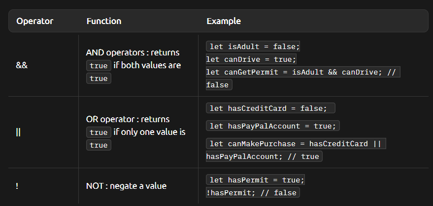

# Boolean
- represnet only values : true or false
- used for making decisions based on conditions
- used to check if something is true or false, control program flow, or evaluate conditions

## how
```javascript
let isLoggedIn = true;
let isNightTime = false;
```
## logic operators


