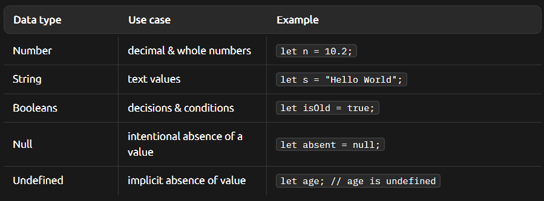

# what are data types ?
Data types are like different boxes with specific shapes and sizes, where each box can only hold certain things.

# why are they important ?
Data types are crucial because they help the computer understand what to do with your data. 

# when & how to use them

