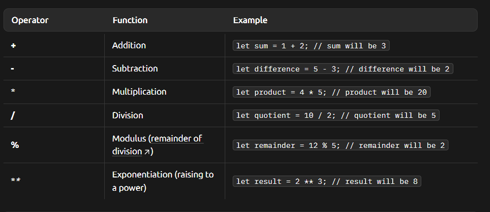
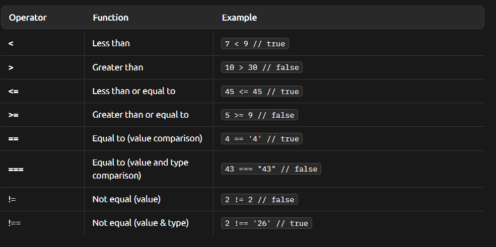
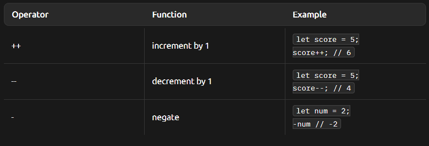

# Numbers & Arithmetic

- Represent any whole or decimal number values

- Used for calcuations, counting and storing numerical values.

- Used any time you need to perform math, track quantities, or store numerical data.

## how
```javascript
let age = 30; // Integer
let price = 12.99; // Float
```

## Arithmetic Operations



**comparison operators**



** unary operators**

