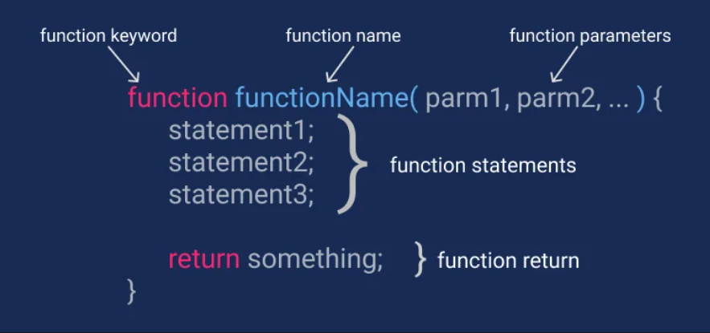
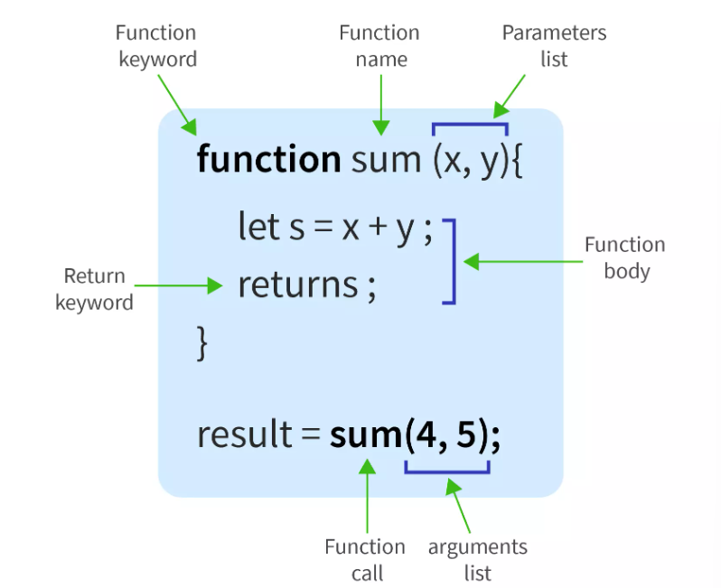

# loops & functions
It's a set of instructions bundled together, designed to perform a specific task or action when called. Functions execute a sequence of code to achieve a desired outcome in your program.

- Reusability
- Organization
- Efficiency

we use it to perform a specific task repeatedly, like:
    - Validating user input
    - Calculating values 
    - Updating the user interface

## how

# Calling The Function 

