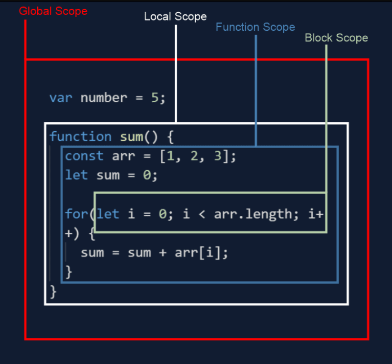

# Scope
Imagine scope like a room:

* If you declare a variable inside a room (like inside a function or block), you can only use it inside that room.

* If you declare a variable outside the room, you can use it anywhere.

### why
- Keeps things organized 
- Controls access
- Protects data

### when to use it
* Declare variables inside functions
* Control function access
* Improve code clarity

### how to use it
JavaScript has three main scopes :

* **Global Scope :** Variables declared outside any function are accessible everywhere in your program.
* **Local Scope :** Variables declared inside a function are only accessible within that function.
* **Function Scope :** The function itself and its local variables form a scope within which they can access each other.



`example`

```javascript
// Global variable accessible everywhere
let greeting = "Hello!";

function sayHello() {
  // Local variable only accessible within this function
  let name = "World";
  console.log(`${greeting}, ${name}`); // Prints "Hello, World!"
}

sayHello(); // Accesses and prints local variable inside function
console.log(greeting); // Still accesses global variable

// Cannot access "name" outside the function (local scope)
```

## var vs let vs const : 

1.  **`var`:**

    * `var` has function-level scope, meaning it is only scoped to the function where it's declared.
    * It is hoisted to the top of its function or global context.
    * `var` allows variable redeclaration and can be reassigned.

    ```javascript
    function exampleVarScope() {
      if (true) {
        var x = 10;
        console.log(x); // Output: 10
      }
      console.log(x); // Output: 10
    }

    exampleVarScope();
    ```
2.  **`let`:**

    * `let` has block-level scope, which means it is scoped to the nearest enclosing block (if, for, while, etc.).
    * It is also hoisted, but unlike `var`, it is not initialized until the line of code where it is declared.
    * `let` allows variable redeclaration within different blocks but cannot be redeclared in the same block.

    ```javascript
    function exampleLetScope() {
      if (true) {
        let y = 20;
        console.log(y); // Output: 20
      }
      // console.log(y); // Error: y is not defined

      for (let i = 0; i < 3; i++) {
        console.log(i); // Output: 0, 1, 2
      }
      // console.log(i); // Error: i is not defined
    }

    exampleLetScope();
    ```
3.  **`const`:**

    * `const` also has block-level scope.
    * It must be initialized at the time of declaration and cannot be reassigned.
    * While the value assigned to a `const` variable cannot be changed, the contents of objects or arrays declared with `const` can be modified.

    ```javascript
    function exampleConstScope() {
      const z = 30;
       z = 31; // Error: Assignment to constant variable
    }

    exampleConstScope();
    ```