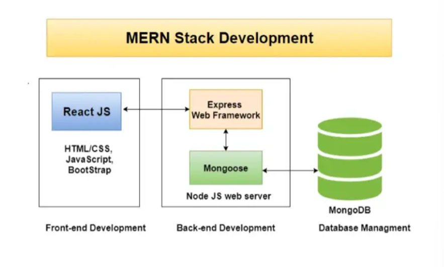

# Learn the fundamentals of the Mern stack 

## what is a stack 
stack of thecnologies is a set of frameworks and tools used to develop a software product 

## Exemples
 - MERN (mongoDB, ExpressJS, ReactJs, NodeJS)
 - LAMP(linux, apache, mysql, php)
 - MEAN (mongoDB, ExpressJS, AngularJs, NodeJS )

## MERN Stack
 
 - M : MongoDB (Database) a popular NoSQL (Non-Structered Quert Lnaguage) Database systeme (*document-oriented database*)

 - E : Express, Middleware that sits on top of the server side node.js web APIs
 (*Jvascript-based server-side framework that runs within Nodejs*)
 
 - R : React a client side Javascript Library 

 - N : Node JS, Javascript web server development environment

 Mern Stack is a javascript Stack that utilized for quicker organisation of Full-Stack web applications

 

## Impacts of MERN

- Cost-effective
- Seo friendly
- Better performance
- Improves Security
- Provide the fastest delivery
- provides fastest modiifications
- Open Source
- Easy to switch between client and server

# MERN Stack Components 

MERN STACK 3-Tier architecture system consist in 3 layers

 1 - front-End tier for the web 
    It's handeled by ReactJS ( afrontend js library)

 2 - the middle tier in the server
    It's handeled by expressjs and nodejs
    Expressjs maintains the server-side framework and middleware, running inside the Nodejs server

3 - Back-End tier as Database
    Handeled by MongoDB (store all your application-related Data)

 
