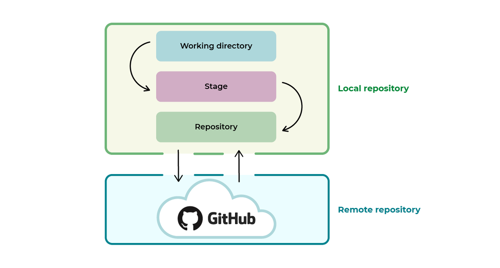
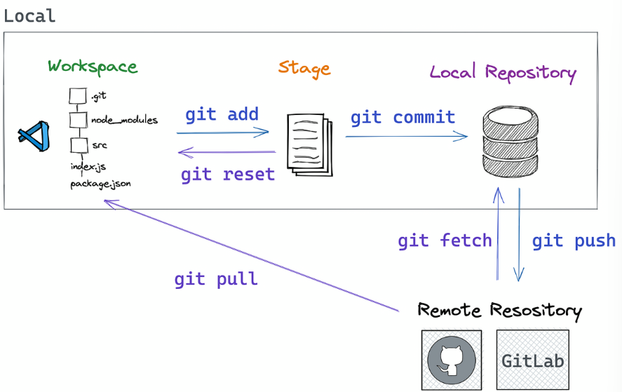

# Git Essentials

## Essentials

### what is a repository 
Think of a repository as a folder that contains all the files for your project, along with the entire history of changes.

# How
  
## locl repository 
 located on the developer's machine it tracks the local chnages

## Remote Repository 
 Hosted on a server or a cloud based platform like **Github**, Gitlab, or Bitbucket.
 

-> Changes made in the **local repository** can be pushed to the **remote repository**

## Git Workflow 

# Git commands
  
  ## git int
   - initilize a repository inside the working directory 
   - Sets up the tools Git ned to begin tracking chnages made to the project
    
  ## git add <filename>
    - it will add the changes you've done to your file to the **staging area**

    or **git add .**
    - to add all chnages in the current directory

    ## git commit -m "Your comit message"
    - records the changes in the repository
    - creates a new commit
    - epresents a snapshot of the project's state at a given point in time

    ## git status 
     helps you keep track of the changes in your working directory

    ## git diff <filename>
     It displays the changes line by line, highlighting additions (+) and deletions (-).

    ## git log
     It shows a list of commits

    ## git reset
    It allows you to unstage changes in your working directory
    