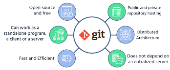

# Git

## what is GIT

- Git is a distributed version control system (VCS) 

- Git allows you to keep track of changes made to a project over time, stoting those changes , then allowing you to reference  them as needed .

## why use git 
 
